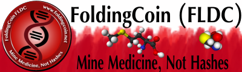

# FoldingBrowser

[FoldingCoin](http://foldingcoin.net/) All-In-One Installer and Web Wallet interface

## Releases

- See [FoldingBrowser Releases](https://github.com/Hou5e/FoldingBrowser/releases) for Windows installer
- FoldingBrowser is written in VB.NET, compiled with VS2013, and currently based on [cefsharp/49](https://github.com/cefsharp/CefSharp/tree/cefsharp/49)

## License

FoldingBrowser is [licensed](Browser/bin/Release/LICENSE.txt) under a [BSD](http://opensource.org/licenses/BSD-3-Clause "BSD License") license.

## Contact

Jump on the [FoldingCoin Slack](https://foldingcoin.slack.com/messages/general/), and I'm user hou5e, or [BitcoinTalk forum](https://bitcointalk.org/index.php?topic=781352), user Hou5e
